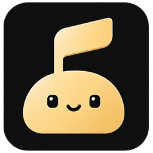
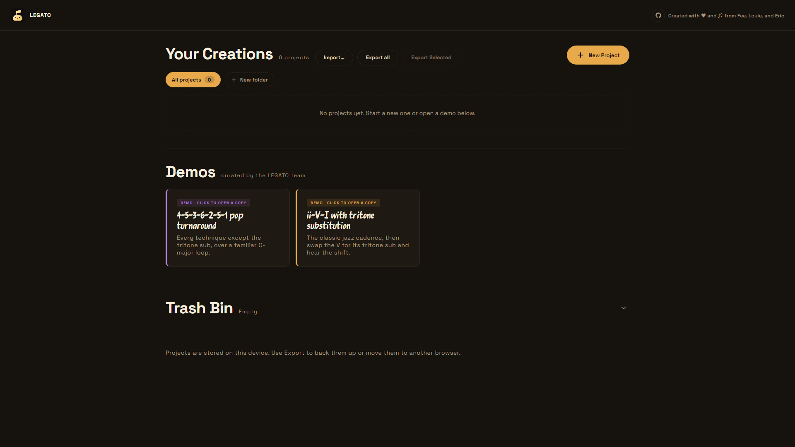
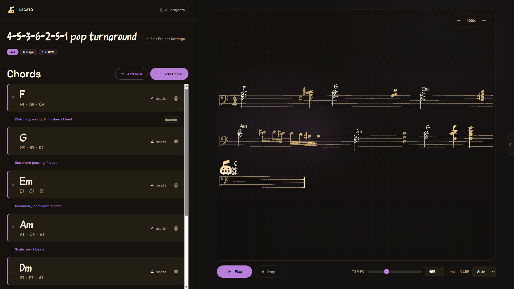
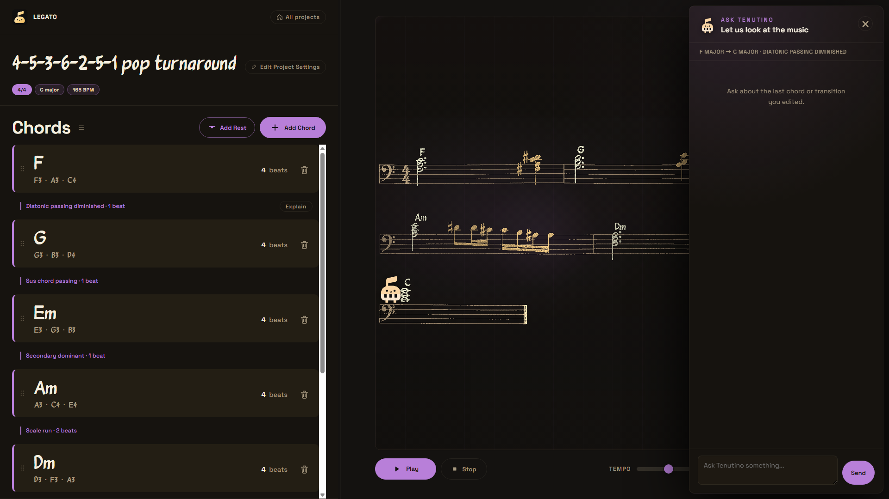

# LEGATO

<p align="center">
  
</p>

<p align="center"><strong>An interactive AI music tutor for composing, hearing, and understanding chord transitions.</strong></p>

<p align="center">
  OpenAI Build Week · Education · Built with Codex and GPT-5.6
</p>

LEGATO helps intermediate-to-advanced pianists learn harmony through experimentation. Instead of generating a finished progression and hiding the reasoning, LEGATO lets a learner build exact chord voicings, connect them with a harmonic technique, see and hear the compiled result, and ask the Tenutino tutor what changed and why it works.

The result is a complete learning loop: **compose → connect → see → hear → understand → revise**.

## Product tour

### Project library



Create and organize local projects, move work between browsers with JSON import/export, or open a bundled progression for an immediate walkthrough.

### Progression studio



Edit exact chord voicings and transition techniques on the left while the compiled notation, playback transport, and animated Tenutino companion remain synchronized on the right.

### Tenutino AI tutor



Ask about the most recently edited chord or seam using score-aware Explain, Suggestions, and conversational Ask modes.

## The problem

Music-theory resources often explain harmony away from the instrument, while composition tools often produce or play music without teaching the decisions inside it. Pianists need a way to compare their own voicings and transitions in context—visually, aurally, and conversationally—without surrendering control to an opaque generator.

LEGATO keeps the learner's notes as the source of truth. AI explains the learner's musical choices; it does not replace them.

## Features and functionality

### Compose with exact voicings

- Build chords on an interactive piano using 11 quality presets: Major, Minor, dominant 7, major 7, minor 7, diminished, diminished 7, half-diminished 7, sus2, sus4, and augmented.
- Toggle individual MIDI notes to control register, spacing, doubling, and inversion. The notes entered are the notes rendered and played.
- Add rests, set chord duration in counted beats, drag to reorder material, and edit or delete any item.
- Configure tempo, simple or compound meter, key signature, clef, accent colour, and chord-symbol typography.

### Explore harmonic transitions

Each seam between two chords can use a direct transition or one of eight techniques:

| Technique | What LEGATO inserts |
| --- | --- |
| Diatonic passing diminished | A diminished seventh chord approaching the target |
| Secondary dominant | A dominant seventh that tonicizes the arriving chord |
| Tritone substitution | A substitute dominant resolving into the target |
| 2-5-1 insert | A two-chord ii–V approach to the destination |
| Sus chord passing | A suspended sonority on the target root |
| Leading-tone bass | A single chromatic approach note below the target |
| Scale run | A capped chromatic line from the current top note toward the target |
| Arpeggiated bridge | An ascending arpeggiated dominant bridge |

LEGATO filters techniques by both musical eligibility and the time available in the departing chord. Generated connective material is voice-led near the current register, while user-authored voicings are never rewritten.

### See and hear one shared musical result

- VexFlow engraves the compiled progression with key-aware and chord-aware note spelling, accidentals, rests, dotted durations, and ties across measures.
- Tone.js plays a sampled piano from the exact same compiled event list used by the score.
- Play, pause, resume, stop, tempo adjustment, and notation zoom are available from the transport.
- Measure highlighting, score particles, and Tenutino's animated movement follow the audio timeline, including wrapped systems and partial final measures.

### Learn with Tenutino, the GPT-5.6 tutor

Tenutino supports three focused modes:

- **Explain** describes what the learner hears, why the transition works, one experiment to try, and a reflection question.
- **Suggestions** proposes one concrete change and explains the musical reason for it.
- **Ask** answers a free-form question conversationally using the current score context.

The tutor is grounded before GPT-5.6 is called. LEGATO deterministically computes the selected measure, exact MIDI voicings, generated notes, common tones, bass and soprano motion, pitch-class motion, interval changes, rhythmic cost, and technique metadata. GPT-5.6 turns those supplied facts into concise pedagogy rather than guessing them from a chord label. Explain and Suggestions use strict structured-output schemas; Ask uses validated plain text.

## Quick judge walkthrough

1. Start LEGATO and open one of the two bundled demo projects. No sample-data setup is required.
2. Select a chord to inspect its exact notes, or add a chord and customize its voicing on the piano.
3. Open a transition between two chords and choose an eligible technique.
4. Press Play to hear the same notes shown in the score and watch the playback visualization track them.
5. Open Tenutino, choose **Explain** or **Suggestions**, or ask a question about the focused transition.
6. Change a voicing or technique, replay it, and compare the tutor's new explanation.

The **4-5-3-6-2-5-1 pop turnaround** demo presents a longer loop with several transition techniques. The **ii-V-I with tritone substitution** demo provides a short before-and-after jazz example.

## Run locally

### Requirements

- Node.js 20 or newer
- A modern browser with Web Audio support
- Internet access for the CDN-hosted VexFlow, Tone.js, Three.js, SortableJS, and first-load piano samples
- An OpenAI API key only if you want to use Tenutino; composition, notation, playback, and project management work without it

There are no npm dependencies to install and no database to configure.

### Start the app

```bash
npm start
```

Open [http://localhost:8000](http://localhost:8000). Do not open `index.html` directly because browser ES modules require an HTTP server.

To use a different port:

```bash
# macOS or Linux
PORT=8001 npm start
```

```powershell
# Windows PowerShell
$env:PORT = "8001"
npm start
```

### Enable GPT-5.6 coaching

Set the API key on the server before starting LEGATO. Never add it to client-side code or commit it to the repository.

```bash
# macOS or Linux
export OPENAI_API_KEY="your-api-key"
export OPENAI_MODEL="gpt-5.6" # optional; this is already the default
npm start
```

```powershell
# Windows PowerShell
$env:OPENAI_API_KEY = "your-api-key"
$env:OPENAI_MODEL = "gpt-5.6" # optional
npm start
```

`server.mjs` serves both the static app and the local `/api/coach.js` route. The same handler in `api/coach.js` can run as a Vercel serverless function; set `OPENAI_API_KEY` and optionally `OPENAI_MODEL` in the deployment environment.

## Project storage and portability

Projects and folders are autosaved in browser `localStorage`; no account is required. The library supports creating, renaming, duplicating, organizing, selecting, exporting, importing, trashing, restoring, and permanently deleting projects. JSON export provides a versioned, validated way to move work between browsers or devices. Bundled demos are cloned before editing, so the originals remain available.

## Architecture

The core architectural decision is a pure `compile(progression)` boundary:

```text
Editor actions
     │
     ▼
Progression state ──► compile() ──► atomic musical segments
                                      ├──► VexFlow notation
                                      ├──► Tone.js playback + visual timeline
                                      └──► deterministic coach evidence ──► GPT-5.6
```

This single event list prevents notation, audio, animation, and tutoring context from drifting apart.

| Area | Responsibility |
| --- | --- |
| `js/state.js` | Runtime data contract, validation, factories, seam reconciliation, compile entry point |
| `js/engine/` | Chord spelling, transition generation and eligibility, rhythm, timing, and closest-voicing search |
| `js/sheet-music/` | VexFlow rendering, score layout, playback timeline, particles, and Tenutino movement geometry |
| `js/audio/playback.js` | Tone.js sampler scheduling and transport state |
| `js/coach/` | Evidence extraction, prompts, client validation, and tutor modes |
| `api/coach.js` | Server-only Responses API call and mode-specific output validation |
| `js/persistence.js` | Versioned local project store, folders, trash, import, and export |
| `js/views/` and `js/ui/` | Router-driven library and editor experiences |

The frontend uses vanilla HTML, CSS, and JavaScript ES modules, so the source runs directly in the browser without a build step.

## How we collaborated with Codex

We used Codex as an engineering collaborator across the full project lifecycle, not as a one-shot code generator. We began by giving Codex a written product plan, a canonical music data model, explicit acceptance criteria, and ownership boundaries. For each iteration, Codex inspected the existing repository, proposed or implemented a scoped change, ran the relevant tests, and helped us review regressions before the next decision.

### Decisions we made

The human team retained product, music, engineering, and design direction. Our key decisions included:

- **Teach rather than generate.** We chose an Education product for pianists who already understand basic chords, with AI supporting active listening and revision instead of composing on the learner's behalf.
- **Store notes, not recipes.** An explicit MIDI-note array is authoritative. Root and quality are optional display hints, so learners keep complete control of voicing, octave, doubling, and inversion.
- **Make “what you see” equal “what you hear.”** We chose one pure compiler and one segment contract for notation, playback, animation, and tutor grounding.
- **Constrain the theory engine.** We selected the eight techniques, their musical definitions, beat costs, eligibility rules, and the rule that generated material—but never a user's chord—may be voice-led.
- **Ground the tutor deterministically.** We decided code should calculate objective musical evidence and GPT-5.6 should explain it. The key signature is treated as a spelling instruction, not proof of a tonal centre.
- **Prefer a local-first, judge-runnable product.** We chose a build-free frontend, browser storage, versioned JSON import/export, bundled demos, and an optional server-only AI key.
- **Build a coherent studio experience.** We directed the editorial sand-and-hologram visual language, project library, interactive score, animated Tenutino character, and compact three-mode tutor experience.

### Where Codex accelerated the workflow

- Turned the agreed state and compiler contracts into a modular vertical slice spanning the theory engine, notation, playback, UI, persistence, and server endpoint.
- Helped refactor a fast-moving multi-branch codebase without abandoning the established data model or re-voicing user input.
- Implemented and debugged difficult edge cases such as seam preservation after reorder, technique beat budgets, cross-measure ties, enharmonic spelling, rests, compound-meter durations, pause/resume synchronization, wrapped score systems, and malformed tutor responses.
- Converted discovered bugs and musical invariants into regression tests, shortening the loop from observation to verified fix.
- Accelerated late-stage product polish: project folders and trash, bulk export, responsive score layout, transport states, accessible labels, startup choreography, particle timing, and Tenutino's score-following motion.
- Audited the final repository and submission requirements, then helped turn the implementation history into reproducible setup and testing documentation.

Codex provided speed and breadth; we supplied the problem, musical judgment, priorities, constraints, and final approval. When generated code or a proposed interaction conflicted with the learning goal or musical contract, we corrected the requirement and asked Codex to revise against the written source of truth.

### How GPT-5.6 contributed to the final result

GPT-5.6 is both part of the building workflow through Codex and a user-facing component of LEGATO. At runtime, the server calls GPT-5.6 through the OpenAI Responses API to transform verified score evidence into a warm, concise explanation, suggestion, or answer. The API key remains server-side, response formats are selected by tutor mode, and every response is validated before the UI renders it.

That division of labour is central to the idea: deterministic code protects musical facts and timing; GPT-5.6 contributes contextual language, teaching strategy, and conversational flexibility.

## Testing

```bash
npm test
```

The current suite contains **97 passing Node tests**. Coverage includes all eight transition techniques, user-voicing integrity, beat budgets, seam reconciliation, rests, rhythm and measure layout, enharmonic spelling, notation/audio synchronization, coach evidence and response schemas, API-key isolation, persistence and folders, playback controls, score particles, and Tenutino positioning.

The core experience can be tested without an API key. Set `OPENAI_API_KEY` to test live GPT-5.6 responses.

## Repository

[github.com/Feegoat06/OpenAI_Build_Week_Project](https://github.com/Feegoat06/OpenAI_Build_Week_Project)
